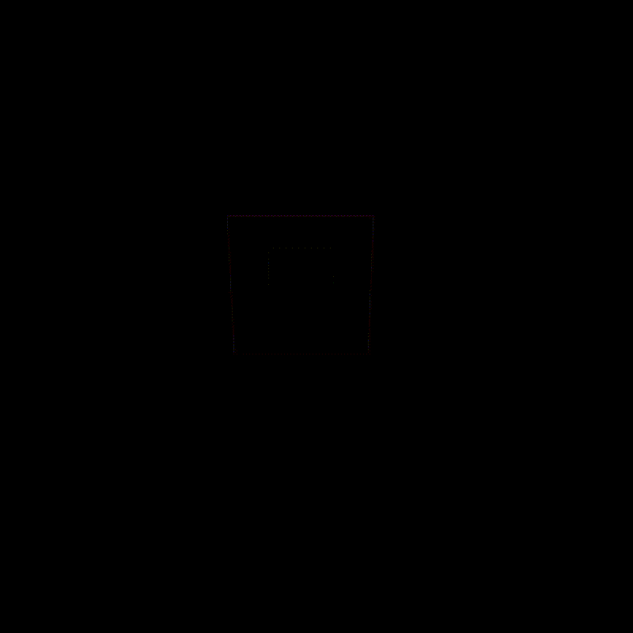
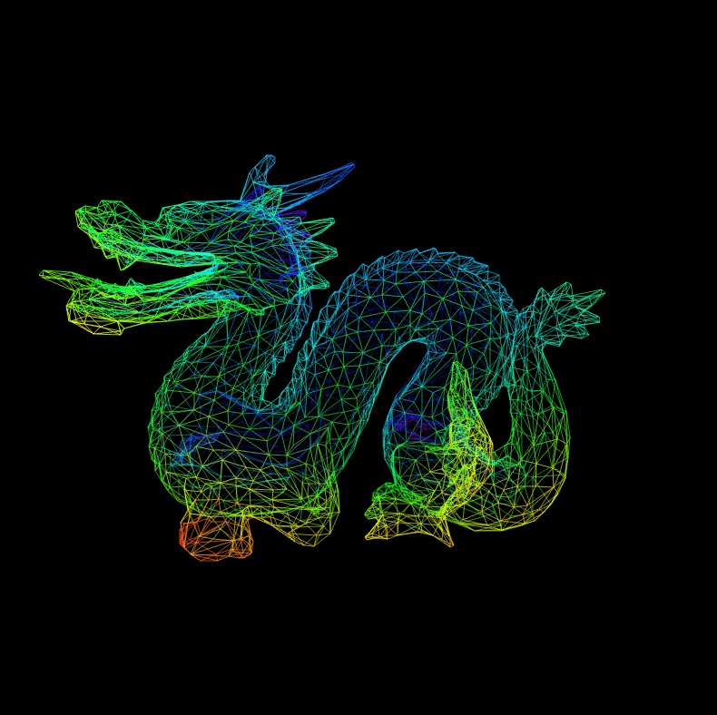

# 3D Renderer

A wireframe 3D renderer built with **C++** and **Raylib 5.5**.

## Preview

<p align="center">
  
  &nbsp;&nbsp;&nbsp;
  
  &nbsp;&nbsp;&nbsp;
</p>

## Features

* Perspective 3D rendering
* Camera movement
* Camera rotation
* Individual shape transformations
* Individual shape rotation
* Target selection between shapes
* Supports rendering arbitrary 3D geometry

## Status

Currently archived.

## Controls

| Key   | Action                                             |
| ----- | -------------------------------------------------- |
| **W** | Move Forward                                       |
| **S** | Move Backward                                      |
| **A** | Move Left                                          |
| **D** | Move Right                                         |
| **T** | Select Next Shape                                  |
| **C** | Toggle Control Mode (Camera / Shape)               |
| **R** | Toggle Rotation (Current Camera or Selected Shape) |

## Building

### Prerequisites

* MinGW-W64 or Visual Studio 2022
* Git

### Windows (MinGW)

```bash
build-MinGW-W64.bat
make
```

### Windows (Visual Studio)

```bash
build-VisualStudio2022.bat
```

Then open the generated `.sln` file.

### Linux

```bash
cd build
./premake5 gmake
cd ..
make
```

### macOS

```bash
cd build
./premake5.osx gmake
cd ..
make
```

## Output

The compiled executable is generated in:

```
bin/debug
```
